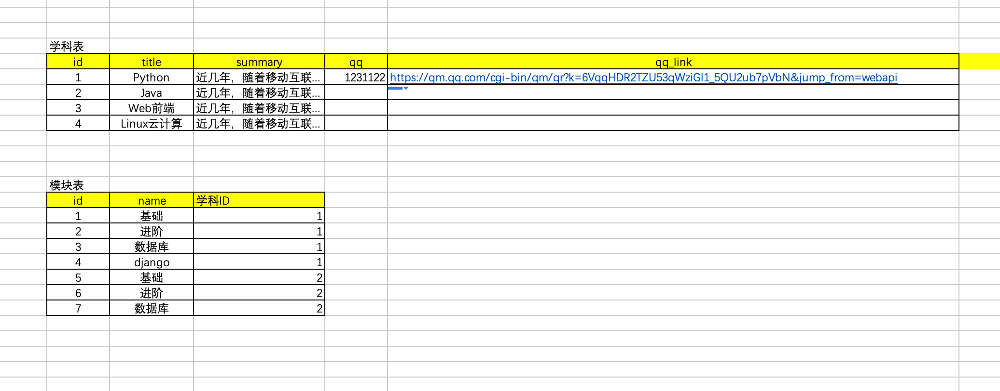
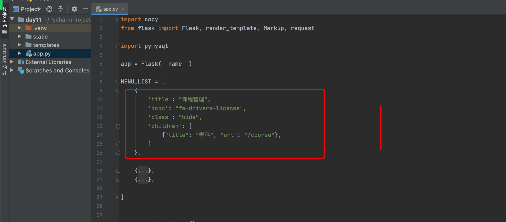
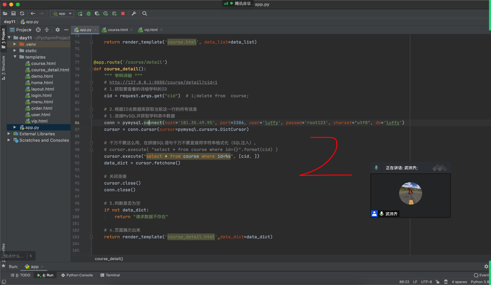
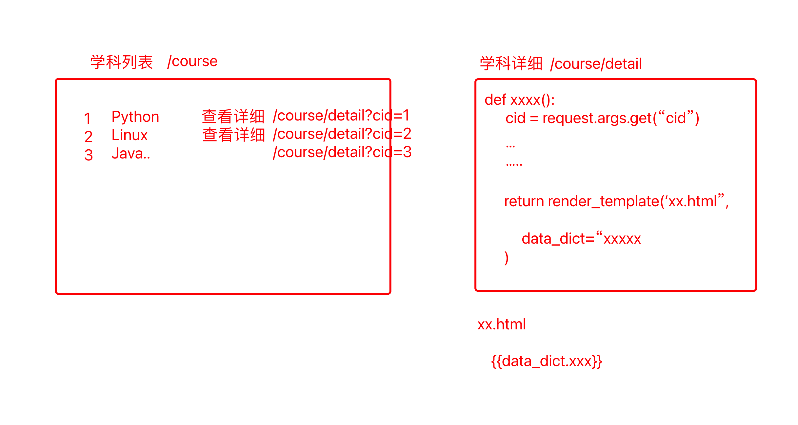
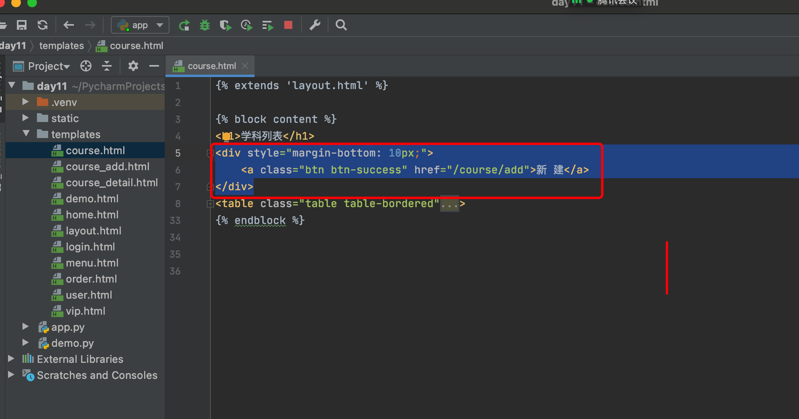
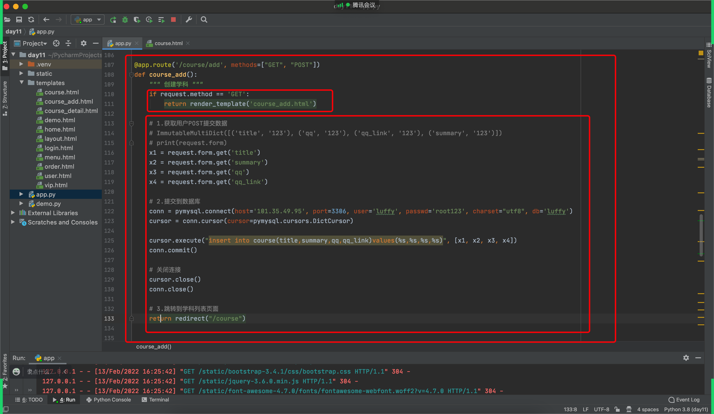
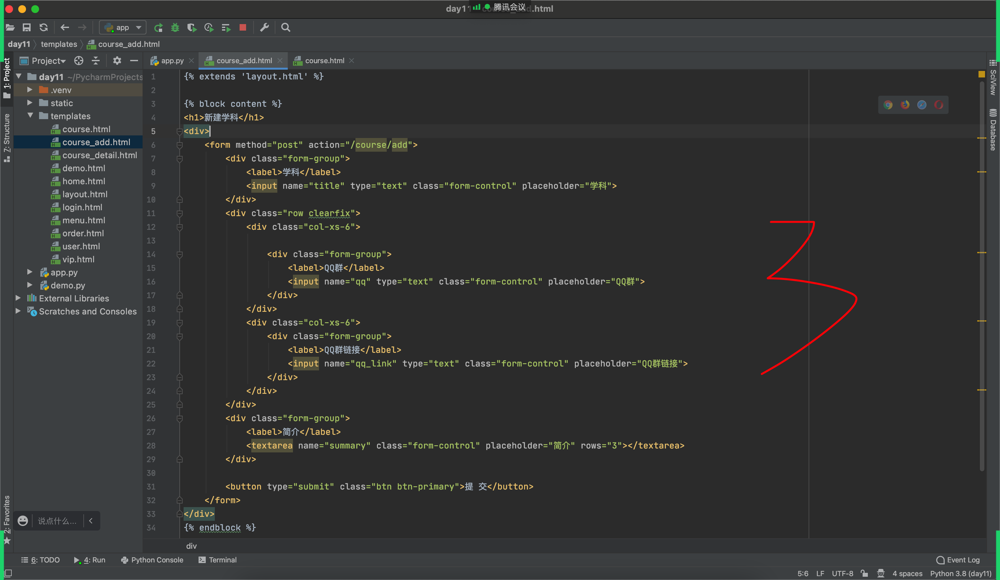
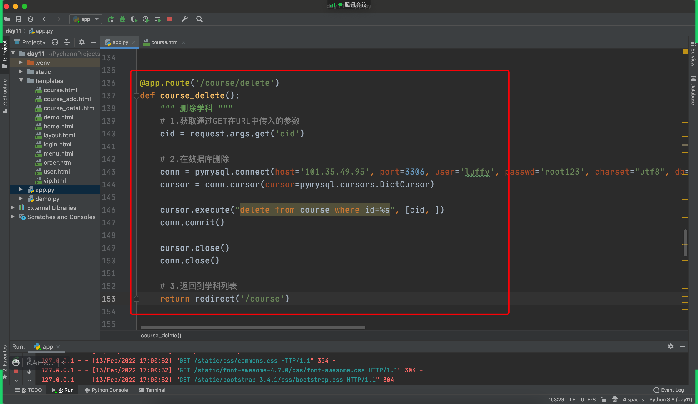
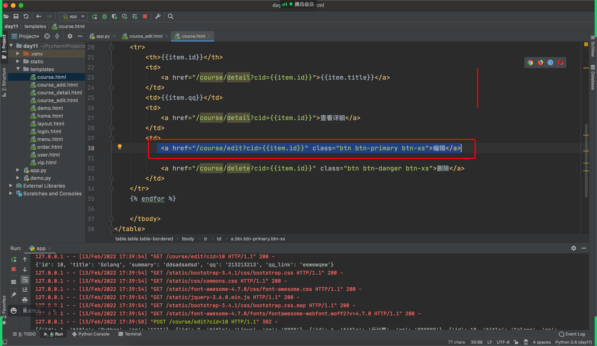
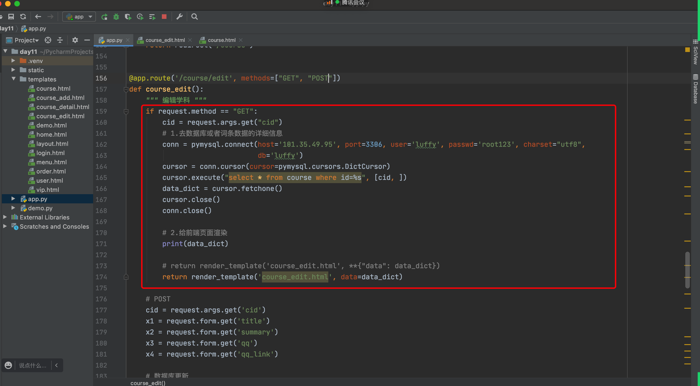

# day12 小猿圈

目标：MySQL + Flask实现后台的业务。


## 1.MySQL数据库

### 1.1 安装 & 启动

安装文档。


### 1.2 连接MySQL

安装 & 连接MySQL

- 安装MySQL
	- win，网站https://downloads.mysql.com/archives/community/ 或 课件网盘
	- mac，官方网站：https://downloads.mysql.com/archives/community/
- navicat
  - 链接: https://pan.baidu.com/s/1knhGGX0Aef6GkFBmwgiDPA 提取码: flpb 
  - mac：https://xclient.info/s/navicat-for-mysql.html#versions


临时连接：

```
IP: 101.35.49.95
port:3306
数据库：luffy
账户：luffy
密码：root123
```


### 1.3 简单的SQL语句

```sql
# 增
insert into 表名(id,title) values(1,"开发");

# 删
delete from 表名 where id=9;

# 改
update 表名 set title="技术部";
update 表名 set title="技术部" where id=10;

# 查
select * from 表;
```

连接并通过python操作数据库：

```
pip install pymysql
```

```python
import pymysql

# 连接MySQL，自动执行 use userdb; -- 进入数据库
conn = pymysql.connect(host='127.0.0.1', port=3306, user='root', passwd='root123', charset="utf8", db='userdb')
cursor = conn.cursor()


# 1.新增（需commit）
cursor.execute("insert into tb1(name,password) values('武沛齐','123123')")
conn.commit()


# 关闭连接
cursor.close()
conn.close()
```


## 2.看业务理表关系




## 3.创建数据库相关表


外键约束：


## 4.业务处理

### 4.1 课程管理

- 先去BootStrap中弄一个静态的表格。
- 去数据库获取数据
- 再将数据嵌入到页面上-> 动态表格数据。




### 4.2 课程详细








### 4.3 问题

```python
@app.route('/course')
def course():
    """ 学科管理 """
	data_list = "...."
    return render_template('course.html', x1=data_list,X=123)
	return render_template('course.html', **{"x1":data_list,"x":123})
```

```html

    <tr>
        <th>{{item.id}}</th>
        <td>
            <a href="/course/detail?cid={{item.id}}">{{item.title}}</a>
        </td>
        <td>{{item.qq}}</td>
        <td>
            <a href="/course/detail?cid={{item.id}}">查看详细</a>
        </td>
    </tr>

```


- 在Python中

  ```python
  v1 = {"k1":123,"k2":456}
  
  v1['k1']
  v1.get("k2")
  
  v2 = (11,22,33)
  
  v2[0]
  ```

- 在Flask模板语法中

  ```
  {{v1.k1}}
  
  {{v1.0}}
  ```

  


### 4.4 添加学科

- 显示添加页面
- 输入内容 & 提交数据
- 后台接收到 & 存储到数据库










### 4.4 删除学科





### 4.5 编辑学科

- 编辑按钮
- 编辑页面 & 默认数据
- 提交&修改







## 5.小优化

### 5.1 数据库操作

参数的提取

```python
def fetch_all(sql,*args):
    conn = pymysql.connect(host='101.35.49.95', port=3306, user='luffy', passwd='root123', charset="utf8", db='luffy')
    cursor = conn.cursor(cursor=pymysql.cursors.DictCursor)

    # cursor.execute("select id,title,qq from course", ())
    cursor.execute(sql,args)
    data_list = cursor.fetchall()

    # 关闭连接
    cursor.close()
    conn.close()

    return data_list
```

```python
data_list = db.fetch_all("select id,title,qq from course")

data_list = db.fetch_all("select id,title,qq from course where id > 10")

data_list = db.fetch_all("select id,title,qq from course where id > %s",10)
```


```python
conn = pymysql.connect(host='101.35.49.95', port=3306, user='luffy', passwd='root123', charset="utf8", db='luffy')
cursor = conn.cursor(cursor=pymysql.cursors.DictCursor)

# cursor.execute("select id,title,qq from course where id=%s", (1,))
cursor.execute("select id,title,qq from course where id=%(n1)s", {"n1":123})
data_list = cursor.fetchall()

# 关闭连接
cursor.close()
conn.close()
```


最终优化后的代码：

```python
def fetch_all(sql, *args, **kwargs):
    params = args or kwargs
    conn = pymysql.connect(host='101.35.49.95', port=3306, user='luffy', passwd='root123', charset="utf8", db='luffy')
    cursor = conn.cursor(cursor=pymysql.cursors.DictCursor)

    cursor.execute(sql, params)
    data_list = cursor.fetchall()

    # 关闭连接
    cursor.close()
    conn.close()

    return data_list
```


### 5.2 数据库连接池

```
pip install dbutils
```

```python
import pymysql
from dbutils.pooled_db import PooledDB

MYSQL_DB_POOL = PooledDB(
    creator=pymysql,  # 使用链接数据库的模块
    maxconnections=5,  # 连接池允许的最大连接数，0和None表示不限制连接数
    mincached=2,  # 初始化时，链接池中至少创建的空闲的链接，0表示不创建
    maxcached=3,  # 链接池中最多闲置的链接，0和None不限制
    blocking=True,  # 连接池中如果没有可用连接后，是否阻塞等待。True，等待；False，不等待然后报错
    setsession=[],  # 开始会话前执行的命令列表。如：["set datestyle to ...", "set time zone ..."]
    ping=0,
    host='101.35.49.95', port=3306, user='luffy', passwd='root123', charset="utf8", db='luffy'
)


def execute(sql, *args, **kwargs):
    params = args or kwargs

    # 获取一个连接（去连接池）
    conn = MYSQL_DB_POOL.connection()
    cursor = conn.cursor(cursor=pymysql.cursors.DictCursor)

    cursor.execute(sql, params)
    conn.commit()
    cursor.close()

    # 连接交还给连接池
    conn.close()


def fetch_all(sql, *args, **kwargs):
    params = args or kwargs
    conn = MYSQL_DB_POOL.connection()
    cursor = conn.cursor(cursor=pymysql.cursors.DictCursor)

    cursor.execute(sql, params)
    data_list = cursor.fetchall()

    # 关闭连接
    cursor.close()
    conn.close()

    return data_list


def fetch_one(sql, *args, **kwargs):
    params = args or kwargs
    conn = MYSQL_DB_POOL.connection()
    cursor = conn.cursor(cursor=pymysql.cursors.DictCursor)

    cursor.execute(sql, params)
    data_list = cursor.fetchone()

    # 关闭连接
    cursor.close()
    conn.close()

    return data_list
```


