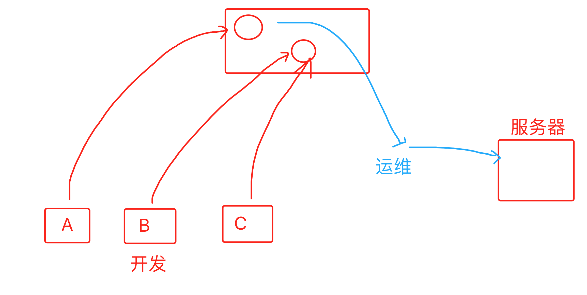
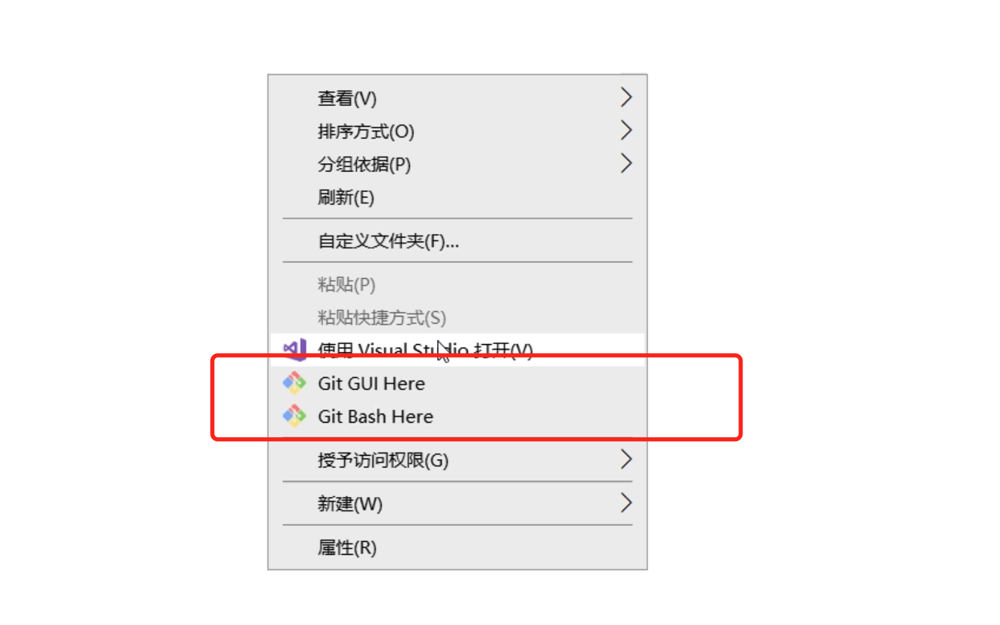
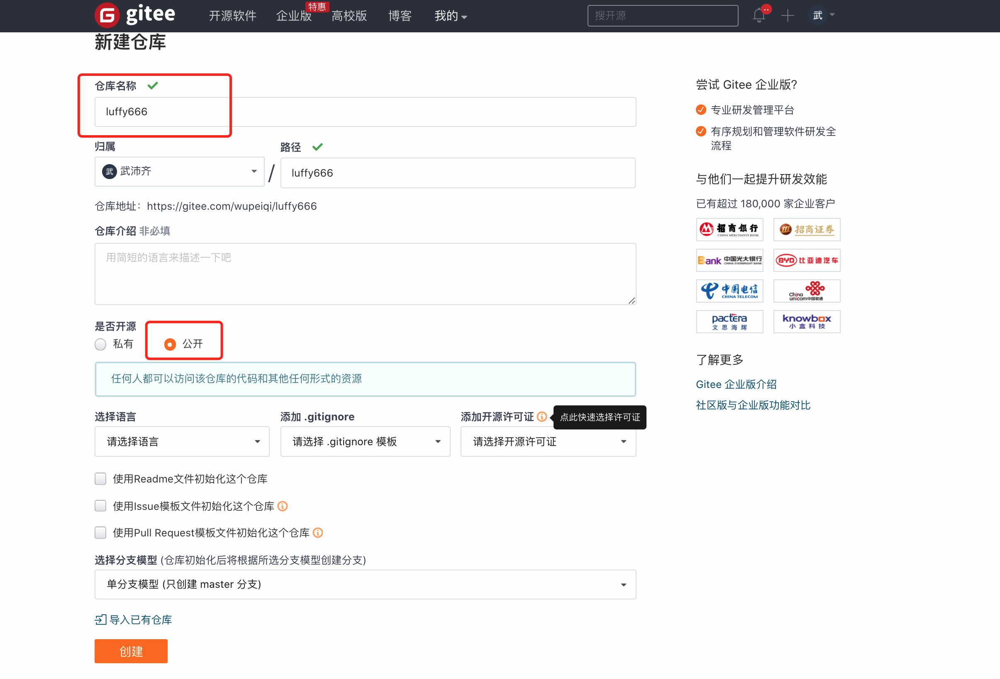
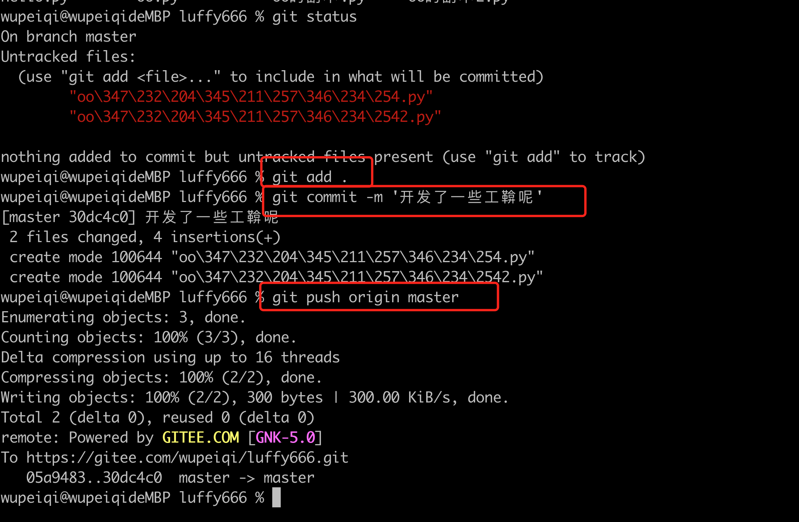
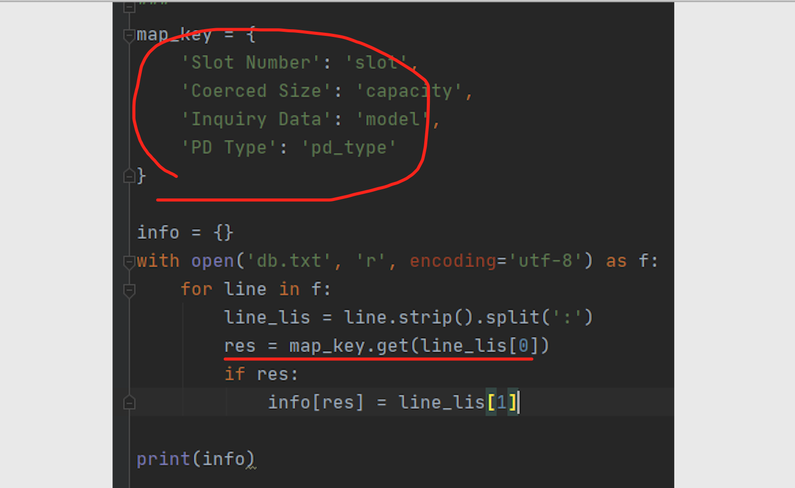
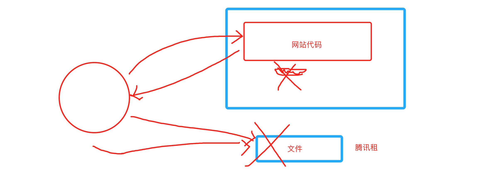

# day02 数据类型

本节设计内容范围：基础 ~ 数据类型

周末直播课的目标： 强化知识 + 实战案例 + 名企面试题  + 收集学员问题 + 答疑

今日概要：

- C语言基本知识

  - 字符和字符串（数组）
  - 指针（内存地址）
  - 结构体（链表）

- Python内存管理机制

- git入门

- 实战案例（7个）

- 企业面试题

- 学员答疑

  

## 1.聊聊C语言

### 1.1 字符和字符串

- 字符，用一个字节来存储字符。

  ```c
  char v1 = 'w'
  ```

- 字符串，用字符数组构造出来的一个字符串。

  ```c
  char v2[8] = {'w','u','p','e','i','q','i','\0'}  // v1 = "wupeiqi"
  
  char v3[] = "wupeiqi"
  ```

  

在C语言中字符串是由多个字符串构成的字符数组搞出来。

在C语言中创建字符数组时，内存地址已创建好了（并且是连续的）。

```c
char v2[8] = {'w','u','p','e','i','q','i','\0'}

char v3[] = "wupeiqi"
```

```
假设：
	0x7ffee1b2b752
	0x7ffee1b2b753
	0x7ffee1b2b754
	0x7ffee1b2b755
	0x7ffee1b2b756
	0x7ffee1b2b757
	...
	0x7ffee1b2b758
```


如果c语言中修改字符串：

- `wupeiqi` -> `wubeiqi`，可以
- `wupeiqi` -> `wupeipeipeipeiqi`，不支持直接字符串修改，而是新创建一份。


在Python中的字符串：

```
name = "alex"
data = name.upper()

v1 = "灿老师谢新雪"
v2 = v1.replace("新","旧的")
```

注意：Python中的字符串不是简单的像C语言存储。


### 1.2 指针

Python的语法中没有提供指针。

想要在Python中创建一个指针（不可以）。


Python中的很多东西都是基于C语言的指针实现。


```c
int v1 = 666; 
int* v2 = &v1; // 指针
```


指针的好处节省内存的开销：

```c
char v1[] = "我是武沛齐，我喜欢嫂子的包的饺子";

char *v2 = &v1[0];
char *v3 = &v1[0];
char *v4 = &v1[0];
char *v5 = &v1[0];
```


在Python中我会写：

```python
v1 = "嫂子满身大汉"
v2 = v1
v3 = v1
```


```
v1 = "嫂子满身大汉"
v2 = v1
v3 = v1
v4 = "嫂子满身大汉"

# 理论上：在内存中再开辟一个空间去存储。
# 优化机制：重用这个字符串。（Python优化机制）
# 如果这个时候定义v4=嫂子满身大汉，是不是会另外开新的地址？
```


```python
>>> v1 = 'wupeiqi'
>>> v2 = v1
>>>
>>>
>>> v3 = "alex"
>>> v4 = "alex"

>>> v5 = [11,22,33]
>>> v6 = [11,22,33]
>>> id(v5)
140231354254848
>>> id(v6)
140231354254912
>>>
>>> v7 = "alex"
>>> v8 = v7
>>> v7[0] = "A" # 不支持对字符串的元素进行修改。

>>> v9 = [11,22,33]
>>> v10 = v9
>>> v9[0] = 666
```

注意：重新赋值？还是修改内部元素。


```python
v7 = "alex"
v8 = "ALEX"
v9 = v7.upper()
```


### 1.3 结构体

```c
int age = 18;
char name[30] = "武沛齐";
```

```c
struct Person{
    char name[10];
    int age
}

struct Person p1 = {"苍老师",29};
struct Person p2 = {"有阪老师",21};
struct Person p3 = {"大桥老师",23};
p1.name
p1.age
```


#### 1.单向链表


```c
struct Node{
    int data;
    struct Person *next; // 指针，存储内存地址
}

struct Node n3 = {33};
struct Node n2 = {22, &n3};
struct Node n1 = {11, &n2};

n1.data
n1.next.data
n1.next.next.data
```

#### 2.双向链表


```c
struct Person
{
    int data;
    struct Person *next;
    struct Person *prev;
};

struct Person p3 = { 33 };
struct Person p2 = { 22 };
struct Person p1 = { 11 };

p1.next = &p2;

p2.next = &p3;
p2.prev = &p1;

p3.prev = &p2;
```


#### 3.双向环状链表


```c
struct Person
{
    int data;
    struct Person *next;
    struct Person *prev;
};

struct Person p3 = { 33 };
struct Person p2 = { 22 };
struct Person p1 = { 11 };

p1.next = &p2;
p1.prev = &p3;

p2.next = &p3;
p2.prev = &p1;

p3.prev = &p2;
p3.next = &p1;
```


## 2.Python内存管理机制

> 引用计数器为主、标记清除和分代回收为辅。

- Python中的所有的东西最终都会根据底层C代码来实现。

  ```
  v1 = 0.9  # 浮点型 --> 结构体（4个值）    {1, 0.9, 上一个, 下一个 }
  v2= 1     # 整型  -->  结构体（4个值）   {1, 1, 上一个, 下一个 }
  ```

- 环状双向链表 refchain，用于保存我们在代码中创建的所有值。
- 创建一个值
  

- 删除一个值

  ```python
  age = 18
  name = "武沛齐"
  nickname = name
  
  del name      # name变量删除; 引用计数器obj_refcnt减 1
  del nickname  # name变量删除; 引用计数器obj_refcnt减 1   ===> 0，如果引用计数器=0则认为他没用，就是垃圾。
  
  # 垃圾回收
  #   1. 在环状链表中摘除。
  #   2. 在内存中去销毁（缓存不销毁），以后如果再用的话。
  ```


上述都是基于引用计数器实现的，如果Python仅用这种是不行的，因为：会存在循环引用导致有些数据永远无法销毁的情况。

```python
v1 = [11,22,33] # [11,22,33,v2]
v2 = [33,44,55] # [11,22,33,v1]
v1.append(v2)
v2.append(v1)

# 两个列表数据内部的引用计数器都是 2
del v1
del v2
# 两个列表数据内部的引用计数器都是 1

=====》 以后代码中再也无法使用v1和v2《======
```


所以搞了一个`标记清除`的技术。

- 专门维护一个链表去存储 ”可变类型“（ 列表、元组、字典、集合、自定义类等对象）。
- 内部会监测是否出现了循环引用，如果出现循环应用就会让各自的引用计数器-1，再检查是否是0；垃圾。


为了提高扫描的效率，Python又搞了一个 `分代回收`的技术。


```c
// 分代的C源码
#define NUM_GENERATIONS 3
struct gc_generation generations[NUM_GENERATIONS] = {
    /* PyGC_Head,                                    threshold,    count */
    {{(uintptr_t)_GEN_HEAD(0), (uintptr_t)_GEN_HEAD(0)},   700,        0}, // 0代
    {{(uintptr_t)_GEN_HEAD(1), (uintptr_t)_GEN_HEAD(1)},   10,         0}, // 1代
    {{(uintptr_t)_GEN_HEAD(2), (uintptr_t)_GEN_HEAD(2)},   10,         0}, // 2代
};
```


## 3. git

Git软件，对文件夹中的文件版本控制（本地）。

代码仓库，保存所有代码，例如：github[公有/私有]、gitee[公有/私有]、gitlab（自己公司）。




### 3.1 Git

- 下载

  https://git-scm.com/

  https://git-scm.com/downloads

- 安装
  

- 使用它做版本控制


### 3.2 本地版本控制

1. 今日要管理的文件件

2. 初始化

   ```
   git init
   ```

3. 开发程序、写代码和修改代码....

4. 让git帮助我们将文件夹下的所有文件生成一个版本

   ```
   git add .              # 将当前文件夹中所有变化（新增、修改内容、删除）暂存起来。【红色->绿色】
   git commit -m "日志"    # 生成一个提交记录
   ```

   ```
   第一次执行git commit 时，提示你要git config 配置（姓名&邮箱），在生成记录的时候要写下。
   git config ...
   ```

   

5. 继续开发、写代码和修改代码....

6. 再生成一个版本

   ```
   git add .              # 将当前文件夹中所有变化（新增、修改内容、删除）暂存起来。【红色->绿色】
   git commit -m "日志"    # 生成一个提交记录
   ```

7. 继续开发、写代码和修改代码....

8. 再生成一个版本

   ```
   git add .              # 将当前文件夹中所有变化（新增、修改内容、删除）暂存起来。【红色->绿色】
   git commit -m "日志"    # 生成一个提交记录
   ```

   

如果说已经开发了10个版本，如果想要回滚到某个之前的版本。

- 查看所有的版本记录

  ```
  git log
  ```

  ```
  commit 171ff4152a248d3ec49b52cdbe10129637cbd14a (HEAD -> master)
  Author: wupeiqi <wupeiqi@live.com>
  Date:   Sun Mar 14 14:10:56 2021 +0800
  
      开发了新功能直播
  
  commit 90db1d73717bce421e93fcd14f542bc93ee83f70
  Author: wupeiqi <wupeiqi@live.com>
  Date:   Sun Mar 14 14:08:13 2021 +0800
  
      初始化所有的文件
  ```

- 回滚到指定版本

  ```
  git reset --hard 90db1d73717bce421e93fcd14f542bc93ee83f70
  ```

- 又让我跳回到之前最新的版本。

  ```
  git reflog
  git reset --hard 版本号
  ```

  

### 3.3 代码仓库

建议：github（全球程序员集散地&交友平台）【以后写功能/找项目，去github找找】

建议：码云 gitee（开源中国）。

注意：千万不要把公司代码放上去（乌云）。

以码云为例：

- 注册码云

- 在码云：

  - 创建一个仓库（文件夹），一般与项目同名。
    
    

    

    

- 在自己电脑：

  - 没创建项目

    ```
    创建项目文件夹
    进入项目的文件夹
    在终端执行 git init
    创建/删除/修改文件....
    git add . 
    git commit -m 'xxxxxx'
    
    git remote add origin https://gitee.com/wupeiqi/luffy666.git（写自己项目的仓库地址）
    git push origin master 
    ```

  - 已经有的项目

    ```
    git remote add origin https://gitee.com/wupeiqi/luffy2.git       【只需要配置一次就行了】
    git push origin master    
    
    注意：git push origin master  是将本地代码推送到代码仓库。
    ```

    

如果想要继续开发代码。




现场作业：

- 码云创建一个仓库
- 本地随便创建项目
- 本地项目推送到码云的仓库


通过上述学习你能了解的：

- gitee创建仓库。
- 本地git管理本地仓库 + 推到远程仓库。
- 本地写代码。


### 3.4 第一天去公司

老板会告诉你去熟悉：https://gitee.com/bestpython/zack.git

通过命令去下载/获取别人的代码：

```
git clone https://gitee.com/bestpython/zack.git
```

```
cd zack
git pull origin master 
```


继续开发代码

```
git add .
git commit -m 'xx'
git push origin master 
```


### 建议

- learn_python
  - day01
  - day02
  - day03 
  - ...

- ftp【https://gitee.com/wupeiqi/kill_task.git】
- 项目为单位创建仓库

```
写新项目：

	1.用pycharm创建一个项目。  D:\proj\crm 【代码+requirements.txt】
	2.创建一个虚拟环境。F:\learn\envs\vcrm
	3.在python中配置 项目 和虚拟 环境关联。
	4.写功能...
	5.生成requirements.txt
		pip freeze > requirements.txt

	6.在码云创建仓库 crm
	7.本地代码提交到 crm 仓库
		cd D:\proj\crm  【代码+requirements.txt】
		git init 
		git add .
		git commit -m '上线'
		git remote add origin http://xxx..xxxxx.git
		git push origin master

	更新代码
		写代码。。。。
		git add .
		git commit -m '上线'
		git push origin master

	更新代码
		写代码。。。。
		git add .
		git commit -m '上线'
		git push origin master

拿到别人的项目，想要在自己电脑上运行：
	1. git clone http://xxx..xxxxx.git
	2. 创建虚拟环境 + 绑定项目
	3. 在虚拟环境中安装相关包
		pip install -r requirements.txt
	4. 运行....


	更新代码（协同开发的权限）
		写代码。。。。
		git add .
		git commit -m '上线'
		git push origin master
```


### 赠送

- 虚拟环境和项目放一起。
  
- 先别放一起。


## 4.项目实战案例


### 4.1 重试执行

场景：通过爬虫访问亚马逊并获取，为指定商品提交价格的所有商家信息。

需求：最多重试5次。

```python
"""
pip install requests
pip install BeautifulSoup4
"""
import requests
from bs4 import BeautifulSoup

# ############################ 向亚马逊发送请求 ############################
res = requests.get(
    url="https://www.amazon.com/gp/aod/ajax/ref=aod_f_new?qty=1&asin={}&pc=dp&pageno=1&filters=%257B%2522all%2522%253Atrue%252C%2522new%2522%253Atrue%257D".format(
        "B07V2BBMK4"),
    headers={
        "User-Agent": 'Mozilla/5.0 (Windows; U; Windows NT 5.2) Gecko/2008070208 Firefox/3.0.1',
        "pragma": "no-cache",
        "upgrade-insecure-requests": "1",
        "cache-control": "no-cache",
        "accept-language": "zh-CN,zh;q=0.9,en;q=0.8,zh-TW;q=0.7",
        "accept-encoding": "gzip, deflate, br",
        "accept": "text/html,application/xhtml+xml,application/xml;q=0.9,image/webp,image/apng,*/*;q=0.8,application/signed-exchange;v=b3;q=0.9"
    }
)
res.close()

if res.status_code == 200:
    print("成功")
else:
    print("请求失败")

# ############################ res.text内容中提取商户和价格 ############################

soup = BeautifulSoup(res.text, 'html.parser')
tag = soup.find(attrs={'id': "aod-offer-list"})
tag_list = tag.find_all(attrs={'id': "aod-offer"})
for tag in tag_list:
    sold_by = tag.find(attrs={'id': "aod-offer-soldBy"}).find('a').text.strip()
    price = tag.find(attrs={'class': "a-offscreen"}).text.strip()
    message = "{}\t\t{}".format(price, sold_by)
    print(message)
```

```python
import requests
from bs4 import BeautifulSoup


def download_page(retry=5):
    while retry > 0:
        res = requests.get(
            url="https://www.amazon.com/gp/aod/ajax/ref=aod_f_new?qty=1&asin={}&pc=dp&pageno=1&filters=%257B%2522all%2522%253Atrue%252C%2522new%2522%253Atrue%257D".format(
                "B07V2BBMK4"),
            headers={
                "User-Agent": 'Mozilla/5.0 (Windows; U; Windows NT 5.2) Gecko/2008070208 Firefox/3.0.1',
                "pragma": "no-cache",
                "upgrade-insecure-requests": "1",
                "cache-control": "no-cache",
                "accept-language": "zh-CN,zh;q=0.9,en;q=0.8,zh-TW;q=0.7",
                "accept-encoding": "gzip, deflate, br",
                "accept": "text/html,application/xhtml+xml,application/xml;q=0.9,image/webp,image/apng,*/*;q=0.8,application/signed-exchange;v=b3;q=0.9"
            }
        )
        res.close()
        if res.status_code == 200:
            return res
        retry -= 1


def run():
    response = download_page()
    if not response:
        print("页面下载失败")
        return
    soup = BeautifulSoup(response.text, 'html.parser')

    tag = soup.find(attrs={'id': "aod-offer-list"})
    tag_list = tag.find_all(attrs={'id': "aod-offer"})
    for tag in tag_list:
        sold_by = tag.find(attrs={'id': "aod-offer-soldBy"}).find('a').text.strip()
        price = tag.find(attrs={'class': "a-offscreen"}).text.strip()
        message = "{}\t\t{}".format(price, sold_by)
        print(message)


if __name__ == '__main__':
    run()
```


### 4.2 构造特定字典

项目背景：服务器资产采集。


需求：

- 文件`disk.txt`

  ```
  Enclosure Device ID: 32
  Slot Number: 1
  Drive's postion: DiskGroup: 0, Span: 0, Arm: 0
  Enclosure position: 0
  Device Id: 0
  WWN: 5000C5007272C288
  Sequence Number: 2
  Media Error Count: 0
  Other Error Count: 0
  Predictive Failure Count: 0
  Last Predictive Failure Event Seq Number: 0
  PD Type: SAS
  Raw Size: 279.396 GB
  Non Coerced Size: 278.896 GB [0x22dcb25c Sectors]
  Coerced Size: 278.875 GB [0x22dc0000 Sectors]
  Firmware state: Online, Spun Up
  Device Firmware Level: LS08
  Shield Counter: 0
  Successful diagnostics completion on :  N/A
  SAS Address(0): 0x5000c5007272c289
  SAS Address(1): 0x0
  Connected Port Number: 0(path0) 
  Inquiry Data: SEAGATE ST300MM0006     LS08S0K2B5NV            
  FDE Enable: Disable
  Secured: Unsecured
  Locked: Unlocked
  Needs EKM Attention: No
  Foreign State: None 
  ```

- 读取文件获取数据并构造成如下格式

  ```python
  info = {
      "slot":"1",
      "capacity":"279.396 GB",
      "model":"SEAGATE ST300MM0006     LS08S0K2B5NV",
      "pd_type":"SAS"
  }
  ```





### 4.3 构造图表


```python
import time
import datetime
import collections

"""
date_dict = {
    '2021-03-14':[1615651200000.0, 0],
    '2021-03-13':[1615564800000.0, 0],
    '2021-03-12':[1615478400000.0, 0],
    '2021-03-11':[1615392000000.0, 0],
    '2021-03-10':[1615219200000.0, 0],
    ...
}
"""

# 构造固定时间格式数据（空）
today = datetime.datetime.now().date()
date_dict = collections.OrderedDict()
for i in range(0, 30):
    date = today - datetime.timedelta(days=i)
    date_dict[date.strftime("%Y-%m-%d")] = [time.mktime(date.timetuple()) * 1000, 0]

# 去数据库获取数据
queryset = [
    ['2021-03-14', 10],
    ['2021-03-13', 19],
    ['2021-03-12', 2],
    ['2021-03-11', 0],
    ['2021-03-10', 1],
]
for row in queryset:
    date_dict[row[0]][-1] = row[1]

# ####################### 结构 ####################
for item in date_dict.values():
    print(item)
```


### 4.4 循环删除问题



- 对象存储
- 网络请求

```
思路：
	- 在数据库中把它删除（网站数据存储到数据库）
	- 去腾讯租的地方删除文件
	
文件：
	- 在数据库中把它删除（网站数据存储到数据库）
	- 去腾讯租的地方删除文件
文件夹：
	- 找到要删除的所有文件
	- 再去在数据库中把它删除（网站数据存储到数据库）
	- 再去去腾讯租的地方删除文件
	类似于：删除文件夹必须先删除文件中中的所有文件，然后才能删除文件夹。
```


注意：我只是已文件和文件为例给他介绍。

```python
# 开头：文件列表
key_list = []

# 要删除的文件夹
folder_list = ["片子", ] # ["片子","喵喵","小罗",嘻嘻嘻嘻嘻]

for folder in folder_list:
    # folder = 片子文件件
    # 进入 `片子文件夹`获取他下面的所有的文件和文件夹
    child_list = ...(project=request.tracer.project, parent=folder).order_by('-file_type')
    
    # 循环 `片子文件夹` 目录下的 文件和文件夹
    for child in child_list:
        # 文件夹
        if child.file_type == 2: 
            folder_list.append(child)
        # 文件
        else:
            key_list.append({"Key": child.key})
            
if key_list:
    # 结果：批量删除所有的文件
    delete_file_list(key_list)
```


### 4.5 仓库管理

> 背景：从入学讲git。
>
>  - 组织，学生加入组织（创建n项目）。
>    	- 组织：[老男孩Python全栈21期](https://gitee.com/old_boy_python_stack_21)
>    	- 学生加入组织
>    - 在组织中创建项目：
>      - 老师，创建1个。
>      - 每个学生，项目。
> - 布置作业 issues（发帖子）
>
> 懒惰，不去评论（助教要求）。
>
> 学技术之后，自己更省事。


```python
import requests

def load_members(org, role):
    data_list = []
    page = 1
    while True:
        result = requests.get(
            url='https://gitee.com/api/v5/orgs/{org}/members'.format(org=org),
            data={
                'org': org,
                'page': page,
                'per_page': 100,
                'role': role
            }
        )
        members = result.json()
        data_list.extend(members)
        if len(members) < 100:
            break
        page += 1
    data = {item['login']: {'username': item['login'], 'nick_name': item['name'], 'repo_name': []} for item in data_list}
    return data
```


### 4.6 发短信

https://pythonav.com/wiki/detail/10/81/

- 注册腾讯云（免费）

- 开通云短信（个人认证）

  - 创建应用

  - 签名（自己去申请公众号）

  - 保留以上获取的信息：

    ```
    appid = 112142311  # 自己应用ID
    appkey = "8cc5b87123y423423412387930004"  # 自己应用Key
    sms_sign = "Python之路" 
    ```

- python发短信

  ```
  pip install qcloudsms_py
  ```

  ```python
  #!/usr/bin/env python
  # -*- coding:utf-8 -*-
  import ssl
  # ssl._create_default_https_context = ssl._create_unverified_context
  from qcloudsms_py import SmsMultiSender, SmsSingleSender
  from qcloudsms_py.httpclient import HTTPError
  def send_sms_single(phone_num, template_id, template_param_list):
      """
      单条发送短信
      :param phone_num: 手机号
      :param template_id: 腾讯云短信模板ID
      :param template_param_list: 短信模板所需参数列表，例如:【验证码：{1}，描述：{2}】，则传递参数 [888,666]按顺序去格式化模板
      :return:
      """
      appid = 112142311  # 自己应用ID
      appkey = "8cc5b87123y423423412387930004"  # 自己应用Key
      sms_sign = "Python之路"  # 自己腾讯云创建签名时填写的签名内容（使用公众号的话这个值一般是公众号全称或简称）
      sender = SmsSingleSender(appid, appkey)
      try:
          response = sender.send_with_param(86, phone_num, template_id, template_param_list, sign=sms_sign)
      except HTTPError as e:
          response = {'result': 1000, 'errmsg': "网络异常发送失败"}
      return response
  def send_sms_multi(phone_num_list, template_id, param_list):
      """
      批量发送短信
      :param phone_num_list:手机号列表
      :param template_id:腾讯云短信模板ID
      :param param_list:短信模板所需参数列表，例如:【验证码：{1}，描述：{2}】，则传递参数 [888,666]按顺序去格式化模板
      :return:
      """
      appid = 112142311
      appkey = "8cc5b87123y423423412387930004"
      sms_sign = "Python之路"
      sender = SmsMultiSender(appid, appkey)
      try:
          response = sender.send_with_param(86, phone_num_list, template_id, param_list, sign=sms_sign)
      except HTTPError as e:
          response = {'result': 1000, 'errmsg': "网络异常发送失败"}
      return response
  if __name__ == '__main__':
      result1 = send_sms_single("15131255089", 548760, [666, ])
      print(result1)
      result2 = send_sms_single( ["15131255089", "15131255089", "15131255089", ],548760, [999, ])
      print(result2)
  ```

  


