# Day12 前端相关（二）

今日概要：

- ES6
- web开发
  - 前后 端不分离，django+ HTML、CSS、JS
  - 前后端分离，django + vue.js 
- 微信小程序开发
- app开发（ uni-app，vue.js ）
- 破解：案例分享（js逆向 前端）


## 1. ES6

JavaScript，编程语言，浏览器中继承的引擎（解释器）可以执行这个编程语言中的代码。

- ECMAScript 5，标准
- ECMAScript 6，标准（功能简洁，有一些老版本的浏览器不支持）

一般情况下：js，es6。


### 1.1 let关键字

```javascript
function func(){
    if(true){
        var name = "武沛齐";
        console.log(name);
    }
    console.log(name);
}

func()
```

```javascript
function func(){
    if(true){
        let name = "武沛齐";
        console.log(name); // 正确
    }
    console.log(name); // 错误
}

func()
```


### 1.2 常量

- 变量，声明之后可以对他进行重复赋值。
- 常量，声明之后不允许重新赋值。

```javascript
function func(){
  	let name = "武沛齐";
    name = "eric";
    console.log(name);
}

func()
```

```javascript
function func(){
  	const name = "武沛齐";
    name = "eric"; // 错误
    console.log(name);
}

func()
```

```javascript
function func(){
  	const info = {id:1,name:"武沛齐"};
    info.age = 18;
    console.log(info);
}

func()
```


### 1.3 解构

```javascript
let [a,b] = [1,2];
```

```javascript
let [foo, [[bar], baz]] = [1, [[2], 3]];
foo // 1
bar // 2
baz // 3

let [ , , third] = ["foo", "bar", "baz"];
third // "baz"

let [x, , y] = [1, 2, 3];
x // 1
y // 3

let [head, ...tail] = [1, 2, 3, 4];
head // 1
tail // [2, 3, 4]

let [x, y, ...z] = ['a'];
x // "a"
y // undefined
z // []
```

```javascript
const arr = [1, 2, 3, 4];

// bad
const first = arr[0];
const second = arr[1];

// good
const [first, second] = arr;
```

```javascript
// bad
function getFullName(user) {
  const firstName = user.firstName;
  const lastName = user.lastName;
}
let obj = {firstName: "wu", lastName: "peiqi"}
getFullName(obj);


// good
function getFullName(obj) {
  const { firstName, lastName } = obj;
}
let obj = {firstName: "wu", lastName: "peiqi"}
getFullName(obj);


// best
function getFullName({ firstName, lastName }) {
}

let obj = {firstName: "wu", lastName: "peiqi"}
getFullName(obj);
```

注意：react-native 开发 app 。


```javascript
// bad
function processInput(input) {
  // ...
  return [left, right, top, bottom];
}

// good
function processInput(input) {
  return { left, right, top, bottom };
}

const { left, right } = processInput(input);
```


### 1.4 字符串相关

```javascript
// bad
const a = "foobar";
const b = 'foo' + a + 'bar';

// acceptable
const c = `foobar`;

// good
const a = 'foobar';
const b = `foo${a}bar`;   // 类似于python的f格式化
```


### 1.5 箭头函数

```javascript
var func = a1 => a1

function func(a1){
    return a1
}
```

```javascript
var func = (a1,a2) => { return a1 + a2 };

function func(a1,a2){
    return a1 + a2;
}
```

箭头函数详单与python的lambda表达式。一般不用。

一般是在执行某个功能，需要我给他传入一个函数为参数时。

```javascript
function f1(){
    ...
}
setTimeout(f1,2000);
```

```javascript
setTimeout(function(){
    
},2000);
```

```javascript
setTimeout( () => {
    
},2000);
```

注意：在箭头函数里面没有自己的this对象。

```javascript
var x1 = "alex";
info = {
    x1: "武沛齐",
    x2: function () {
        console.log(this.x1); // info.x1

        setTimeout(function () {
            console.log(this.x1); // window.x1
        }, 1000)

        setTimeout(() => {
            console.log(this.x1); // 自己没有this，x2中的this， info.x1
        }, 2000)

    }
}
info.x2();
```


### 1.6 面向对象

```javascript
function Foo(x1,x2){
    this.x1 = x1;
    this.x2 = x2;
}

Foo.prototype.doSomething = function(){
    return this.x1 + this.x2;
}

var obj = new Foo(1,2);
var res = obj.doSomething();
console.log(res);
```


```javascript
class Foo{
    constructor(x1,x2){
        this.x1 = x1;
        this.x2 = x2;
    }
    
    doSomthing(){
        return 123;
    }
}
```


更多请参考：https://es6.ruanyifeng.com/


## 2. web开发

先来学习django这个框架。

django，是一个Python的web框架（flask、bottle、webpy、tornado、sanic、fastapi）。

```
pip install django==2.2
```

基于django框架去创建项目，集成：python基础、网络编程、数据库开发、前端。

```
(luffyWeekend) wupeiqi@192 ~ % pip install django==2.2
Looking in indexes: https://pypi.douban.com/simple/
Collecting django==2.2
  Downloading https://pypi.doubanio.com/packages/54/85/0bef63668fb170888c1a2970ec897d4528d6072f32dee27653381a332642/Django-2.2-py3-none-any.whl (7.4 MB)
     |████████████████████████████████| 7.4 MB 412 kB/s
Requirement already satisfied: pytz in ./envs/luffyWeekend/lib/python3.9/site-packages (from django==2.2) (2021.1)
Requirement already satisfied: sqlparse in ./envs/luffyWeekend/lib/python3.9/site-packages (from django==2.2) (0.4.1)
Installing collected packages: django
  Attempting uninstall: django
    Found existing installation: Django 3.2
    Uninstalling Django-3.2:
      Successfully uninstalled Django-3.2
Successfully installed django-2.2
```


接下来，创建Django的项目。

- 其他框架，直接创建py文件。

- django框架，创建很多相关文件，通过命名快速创建

  ```
  django-admin startproject mysite
  ```

   真正开发过程中可以pycharm直接创建。
  


开发一个URL和对应的函数：

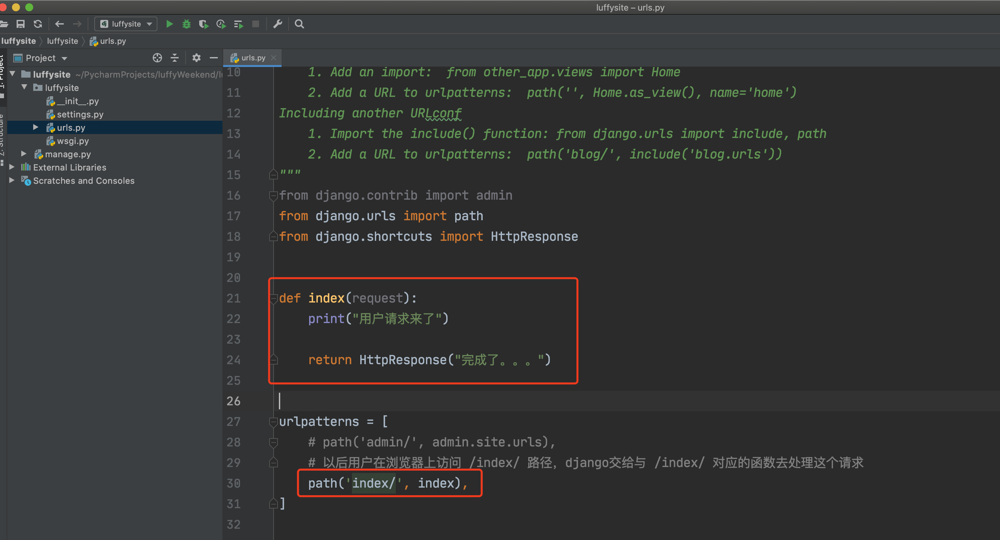


启动django（socket server），网站运行起来。

```
(luffyWeekend) wupeiqi@192 luffysite % pwd
/Users/wupeiqi/PycharmProjects/luffyWeekend/luffysite
(luffyWeekend) wupeiqi@192 luffysite % ls
luffysite	manage.py
(luffyWeekend) wupeiqi@192 luffysite % python manage.py runserver 127.0.0.1:8000
Watching for file changes with StatReloader
Performing system checks...

System check identified no issues (0 silenced).

You have 17 unapplied migration(s). Your project may not work properly until you apply the migrations for app(s): admin, auth, contenttypes, sessions.
Run 'python manage.py migrate' to apply them.

June 06, 2021 - 02:57:58
Django version 2.2, using settings 'luffysite.settings'
Starting development server at http://127.0.0.1:8000/
Quit the server with CONTROL-C.
```

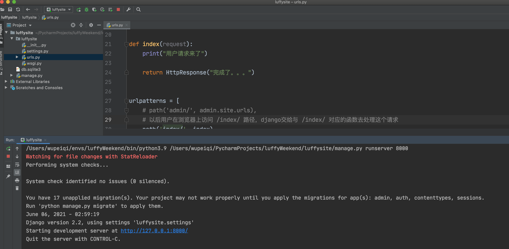


### 小结

- 创建django项目【Pycharm】

  ```
  django-admin startproject mysite 
  ```

  ```
  mysite
  ├── manage.py        # django提供的一些工具和启动命令。
  └── mysite
      ├── __init__.py
      ├── settings.py  # 配置文件
      ├── urls.py      # url和函数对应的关系
      └── wsgi.py      # 底层socket
  ```

- 在urls.py中编写 url和函数

  ```python
  from django.contrib import admin
  from django.urls import path
  from django.shortcuts import HttpResponse
  
  
  def index(request):
      print("用户请求来了")
  
      return HttpResponse("完成了。。。")
  
  
  urlpatterns = [
      # 以后用户在浏览器上访问 /index/ 路径，django交给与 /index/ 对应的函数去处理这个请求
      path('index/', index),
  ]
  ```

- 启动django【Pycharm】

  ```
  cd /Users/wupeiqi/PycharmProjects/luffyWeekend/luffysite
  python manage.py runserver 127.0.0.1:8000
  ```


如果你想创建项目里面有很多的url和函数（业务功能）：

- 创建django项目【Pycharm】

  ```python
  django-admin startproject mysite 
  ```

  ```
  mysite
  ├── manage.py        # django提供的一些工具和启动命令。
  └── mysite
      ├── __init__.py
      ├── settings.py  # 配置文件
      ├── urls.py      # url和函数对应的关系
      └── wsgi.py      # 底层socket
  ```

- 在项目下创建 app （文件夹）

  ```
  cd mysite
  python manage.py startapp app01
  ```

  ```
  mysite
  ├── app01（教学标志）
  │   ├── __init__.py
  │   ├── admin.py
  │   ├── apps.py
  │   ├── migrations
  │   │   └── __init__.py
  │   ├── models.py
  │   ├── tests.py
  │   └── views.py       # 放处理请求的函数
  ├── manage.py
  └── mysite
      ├── __init__.py
      ├── settings.py
      ├── urls.py        # 只写对应关系
      └── wsgi.py
  ```

  

- 在两个文件中编写代码

  - urls.py 写对应关系
    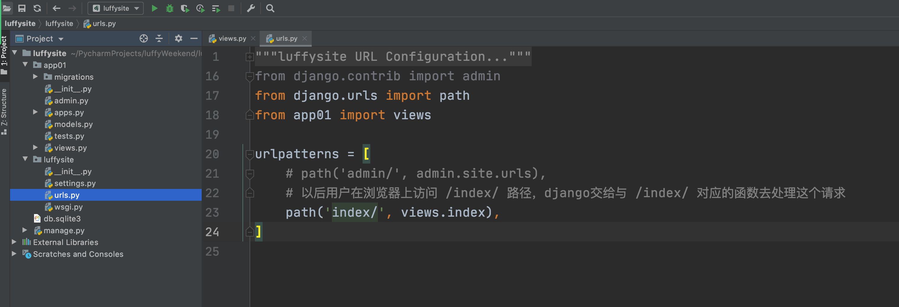
  - app01/views.py 中写业务逻辑
    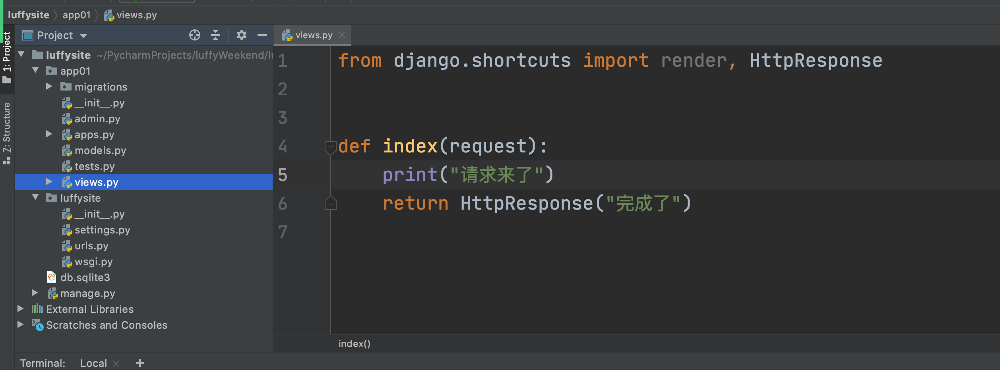

- 启动项目

  

  

### 2.1 前后端不分离

- 前端开发：HTML、CSS、JS
  

- 后端开发：Django

  ```
  前端开发需要将缩写的HTML/CSS/JS给到后端。
  代码和Django项目整合。
  ```

  - url中写对应关系  url和函数对应关系

  - 在函数中编写业务逻辑（数据库中获取、删除、更新）

  - 数据 + 模板语法处理和渲染（模板从前端哪里拿到的）

  - 给用户返回。

    

这种模式，对于后端的压力比较大 + 开发效率不高 + 适合开发小一点的项目。


### 2.2 前后端分离

- 前端开发：HTML、CSS、JS + vue.js框架
- 后端：Django


#### 2.2.1 vue.js框架

- 简单模式

  ```html
  <!DOCTYPE html>
  <html lang="en">
  <head>
      <meta charset="UTF-8">
      <title>Title</title>
      <script src="https://cdn.jsdelivr.net/npm/vue/dist/vue.js"></script>
  </head>
  <body>
  <div id="app">
      {{ n1 }}
      <ul>
          <li>{{n2}}</li>
          <li>{{n3}}</li>
      </ul>
      <input type="text" v-model="n4">
      您输入的是：<span>{{n4}}</span>
  
      <table border="1">
          <tr>
              <th>ID</th>
              <th>Name</th>
              <th>Age</th>
          </tr>
          <tr v-for="item in dataList">
              <th>{{item.id}}</th>
              <th>{{item.name}}</th>
              <th>{{item.age}}</th>
          </tr>
  
      </table>
  </div>
  <script type="text/javascript">
      var app = new Vue({
          el: '#app',
          data: {
              n1: 'Hello Vue!',
              n2: 'alex',
              n3: 'eric',
              n4: "武沛齐",
              dataList: [
                  {id: 1, name: "武沛齐", age: 19},
                  {id: 2, name: "温家华", age: 29},
              ]
          }
      })
  </script>
  </body>
  </html>
  ```

- 脚手架模式，开发项目第三方插件。

  - node.js   +  npm工具（Python + pip）

    ```
    http://nodejs.cn/download/
    ```

  - 建议大家安装淘宝源（pip的豆瓣源）

    ```
    npm install -g cnpm --registry=https://registry.npm.taobao.org
    ```

    ```
    sodu npm install -g cnpm --registry=https://registry.npm.taobao.org
    ```

  - 安装vue先关工具

    ```
    cnpm install @vue/cli  -g 
    cnpm install @vue/cli-init  -g 
    ```

    ```
    sodu cnpm install @vue/cli  -g 
    sodu cnpm install @vue/cli-init  -g 
    ```

  - 创建项目

    ```
    vue init webpack 项目名称
    ```

  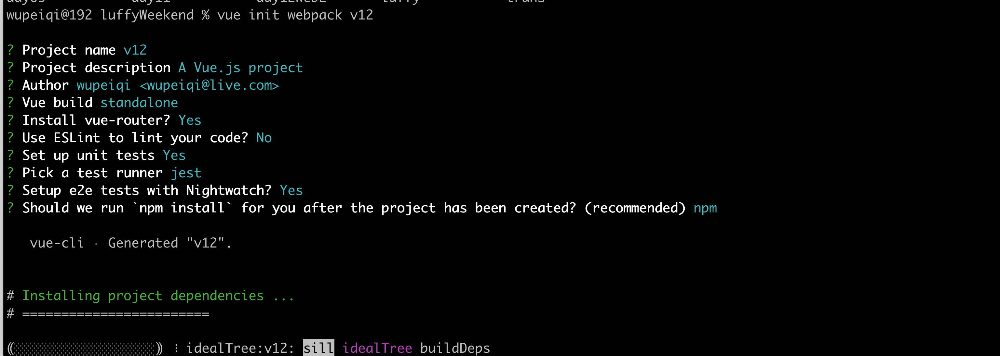

  ```
  cd v12
  npm run dev
  ```

  只要启动起来，浏览器就可以直接访问vue页面（只用于前端开发自己本次开发&测试&调试）。
  


#### 2.2.2 写代码

在刚才创建的哪些文件目录中编写项目代码。（用pycharm去操作）

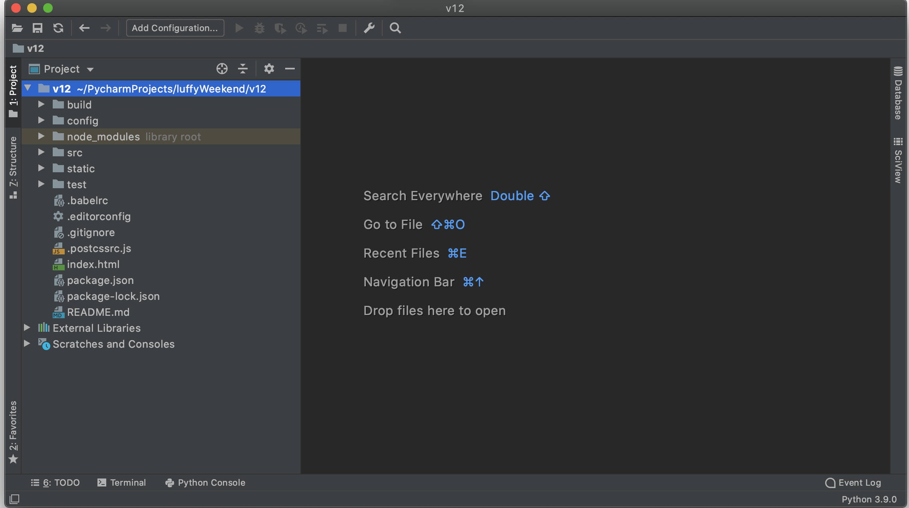


##### 1. router-view


发现：

- 以前，页面的效果都是：jQuery、DOM直接操作HTML中的标签。
- 现在，操作的是javascript语法数据（数据和标签绑定）。

对于前段开发者而言，这种直接操作js的方式可以大大提高的开发效率。


##### 2.for和绑定

```
<template>
  <div>
    <h1>课程列表</h1>

    <div>
      <input type="text" placeholder="ID" v-model="id">
      <input type="text" placeholder="姓名" v-model="name">
      <input type="text" placeholder="年龄" v-model="age">
      <input type="button" value="添加" v-on:click="doAdd">
    </div>
    <table border="1">
      <thead>
      <tr>
        <th>ID</th>
        <th>姓名</th>
        <th>年龄</th>
        <th>删除</th>
      </tr>
      </thead>
      <tbody>
      <tr v-for="(item,index) in userList">
        <td>{{item.id}}</td>
        <td>{{item.name}}</td>
        <td>{{item.age}}</td>
        <td>
          <span v-on:click="doDelete(index)">删除</span>
        </td>
      </tr>
      </tbody>
    </table>
  </div>
</template>

<script>
  export default {
    name: "Course",
    data() {
      return {
        userList: [
          {id: 1, name: "alex", age: 73},
          {id: 2, name: "李杰", age: 84},
        ],
        id: "",
        name: "",
        age: ""
      }
    },
    methods: {
      doAdd() {
        // 找到input框中输入的内容，直接去读js中的id/name/age
        // 添加到table表格中，其实直接放在 userList 中。
        let row = {id: this.id, name: this.name, age: this.age};
        this.userList.push(row);
      },
      doDelete(index) {
        // 根据索引位置将userList中的数据删除
        this.userList.splice(index, 1);
      }
    }
  }
</script>

<style scoped>

</style>

```


##### 3.数据从那哪里来？

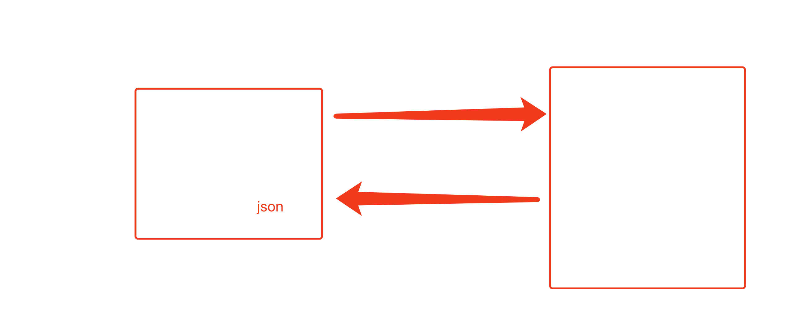

- 前端开发，在vue.js中向后台发送请求（借助第三方组件axios）。

  - 下载安装

    ```
    npm install axios
    ```

  - 项目导入并实现

    ```
    import axios from "axios";
    ```

  - 业务逻辑

    ```
    当打开http://localhost:8080/course连接时，vue.js应该向django发送请求并获取数据。
    获取到数据之后，在页面上展示出来。
    
    - 当打开某个页面（加载某个vue组件时），执行发送请求的动作。
    - 获取结果后已给data中的djangoDataList赋值
    ```

    

- 后端开发，编写后端代码接收前端的请求，并返回相应的内容。

  ```
  给前端开发者提供了接口：http://127.0.0.1:8000/api/
  前端只要访问接口就可以看到相关的json格式的数据。
  ```

  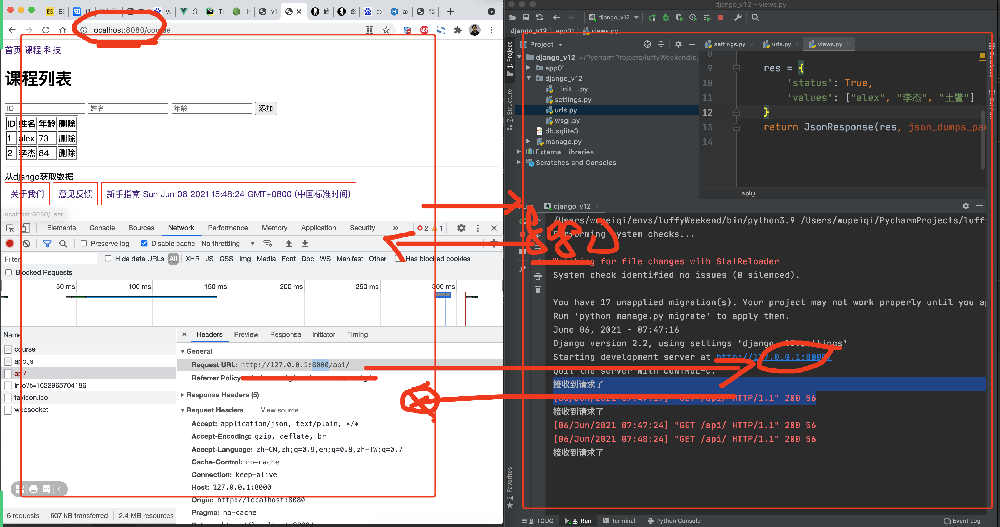


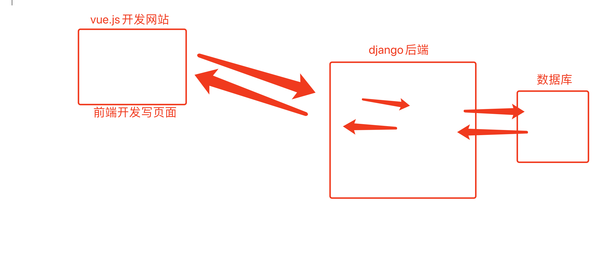

#### 2.2.3 启动项目


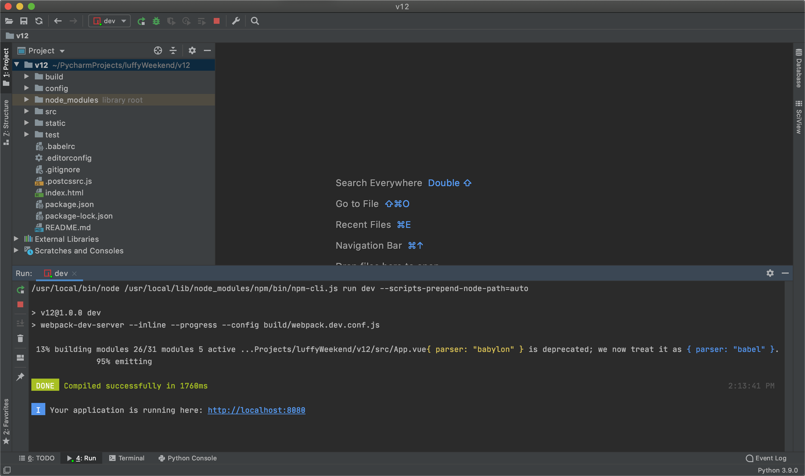


## 3.微信小程序


前戏：

- 下载微信开发者工具（pycharm）

  ```
  https://developers.weixin.qq.com/miniprogram/dev/devtools/download.html
  ```

- 开发微信小程序，腾讯申请账户。

  - 个人版
  - 企业账户，公司做开发。

- 创建项目后，默认为你生成一些文件。（又学习了一门与js相似的语言）
  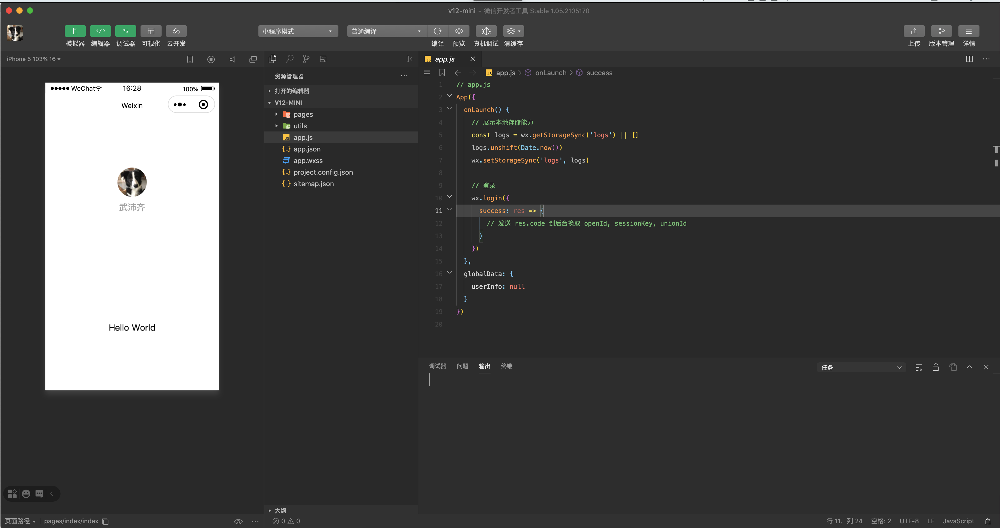


其实，开发微信小程序和通过vue.js写网站一样的道理。

- wxml，HTML（微信小程序自己的）。
- wxss，CSS
- js，js代码


拍卖平台 + 支付 + 定时任务。


## 4. APP开发

- 学安卓：开发安卓项目。
- 学IOS：开发iso项目。
- 一套代码实现app的开发：
  - uni-app，结合 vue.js + 微信小程序 编码和开发方式。
  - react-native，react.js框架（大厂）。
  - flutter，最近比较火。


基于uni-app开发项目：

- 下载和安装 HBuilderX（ pycharm & 继承很多功能 ）


## 小结

- 毕业找Python开发工作
  - Python + django + drf【主】
  - HTML/CSS/JS/jQuery/vue.js/微信小程序（大公司）【辅助】 - 开发出项目。
- 做兼职
  - Python + django + drf 【一半】
  - HTML/CSS/JS/jQuery/vue.js/微信小程序/app开发（大公司） - 开发出项目。【一半】
- 数据分析方向
  - Python + 数据分析
  - django + 一点前端。
- 爬虫方向
  - python + requests模块（网上视频）
  - 前端的东西我不写。
  - 初级，python + requests模块 + js逆向 + 抓包 + 前端
  - 中级，python + requests模块 + js逆向 + 抓包 + 前端 + IOS/安卓逆向。
  - 高级，python + requests模块 + js逆向 + IOS/安卓逆向 + C语言 + 汇编 + java。


## 5. js逆向案例

是基于腾讯的功能的来实现。

问题：请帮助我实现刷播放量。

- 按键精灵（不会技术的人）。

- 定时器去实现 + 点击播放。

-  selenium 可以实现（Python的一个模块）。确定效果不高。

  ```python
  import time
  from selenium import webdriver
  from concurrent.futures import ThreadPoolExecutor
  from selenium.webdriver.common.by import By
  from selenium.webdriver.support.ui import WebDriverWait
  from selenium.webdriver.support import expected_conditions as EC
  from selenium.webdriver.chrome.options import Options
  
  
  def task(url):
      chrome_options = Options()
      chrome_options.add_argument('--headless')
      chrome_options.add_argument('--disable-gpu')
      browser = webdriver.Chrome(executable_path='driver/chromedriver', options=chrome_options)  # 浏览器驱动
      # browser = webdriver.Chrome(executable_path='driver/chromedriver')  # 浏览器驱动
  
      # 输入URL
      browser.get(url)
  
      # 等待视频播放界面，出来之后
      element = WebDriverWait(browser, 15).until(  # 等待播放按钮能够被加载并且能够被点击，15s后如果还没加载完成并且不满足被点击的条件，就抛出异常
          EC.element_to_be_clickable((By.CLASS_NAME, 'v-player'))
      )
      # 点击
      element.click()
  
      time.sleep(5)
  
      browser.quit()  # 关闭窗口
  
  
  def run():
      url = "https://w.yangshipin.cn/video?type=0&vid=d000035rirv"
      task(url)
  
  
  if __name__ == '__main__':
      run()
  
  ```

- 分析网络请求，获取到并破解他的算法。

  - 发送求

    ```
    https://playvv.yangshipin.cn/playvinfo?callback=txplayerJsonpCallBack_getinfo_43433&&charge=0&defaultfmt=auto&otype=json&guid=f0673f92c4593bc453c1293c47e0683b&flowid=4ff5281ade46b64fe31ba649bb900624_4330701&platform=4330701&sdtfrom=v7007&defnpayver=0&appVer=1.3.2&host=w.yangshipin.cn&ehost=https%3A%2F%2Fw.yangshipin.cn%2Fvideo&refer=w.yangshipin.cn&sphttps=1&sphls=&_rnd=1622975107&spwm=4&vid=d000035rirv&defn=auto&fhdswitch=&show1080p=false&dtype=1&clip=4&defnsrc=&fmt=auto&defsrc=1&encryptVer=8.1&cKey=--014548CEB8D0FB6D19EACF7F3D2508C0542BDF42DA78898E705DA8547ADB208FF6917153D0E2AA7ED4FE3FE2326D601DFEF9C4DE71968D254D53CF7ED09D427E7F316D61239D58217460624C670486859282D150127C695397CC1273DA281F530201A7BB3DAA2572A39385A0403AAE379253F597D80C51409E05C77489C9C00B901B6EA8A332FE3485D992B65F4459AB15EE3D15D0D902A5958FADCA139DBE9EF7171E51F2A2E427566A487E3D72B5ED0B&_1622975107559=
    ```

    ```
    guid: f0673f92c4593bc453c1293c47e0683b
    flowid: 4ff5281ade46b64fe31ba649bb900624_4330701
    _rnd: 1622975107
    cKey: --014548CEB8D0FB6D19EACF7F3D2508C0542BDF42DA78898E705DA8547ADB208FF6917153D0E2AA7ED4FE3FE2326D601DFEF9C4DE71968D254D53CF7ED09D427E7F316D61239D58217460624C670486859282D150127C695397CC1273DA281F530201A7BB3DAA2572A39385A0403AAE379253F597D80C51409E05C77489C9C00B901B6EA8A332FE3485D992B65F4459AB15EE3D15D0D902A5958FADCA139DBE9EF7171E51F2A2E427566A487E3D72B5ED0B
    ```

    分析代码和请求规律，找到上述的算法，就可以通过代码直接去伪造发送请求。分析js是否包含这些算法。【JS逆向】

    ```javascript
    createGUID: function(e) {
        e = e || 32;
        for (var t = "", r = 1; r <= e; r++) {
            t += Math.floor(16 * Math.random()).toString(16)
        }
        return t
    }
    ```


B站的APP逆向：

- 安卓、java、猜想
- 写安卓 + so文件
- frida


## 总结

整体认识就可以，侧重点去学后面的知识。


