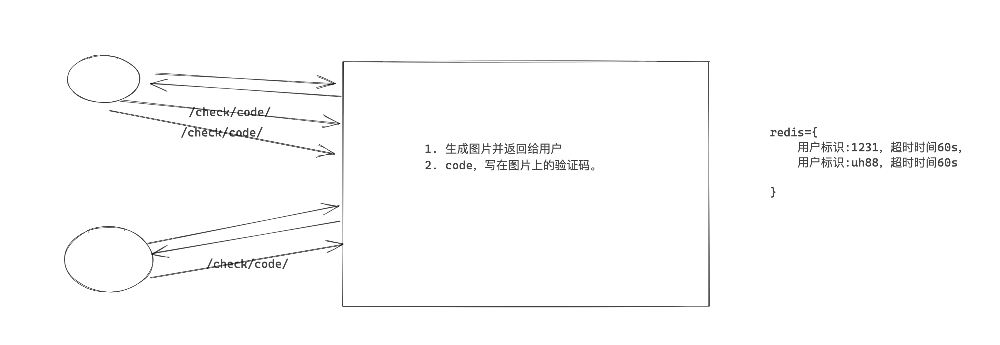
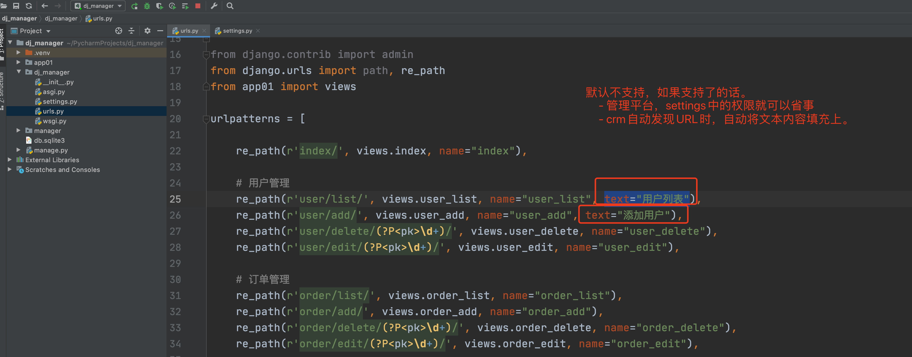
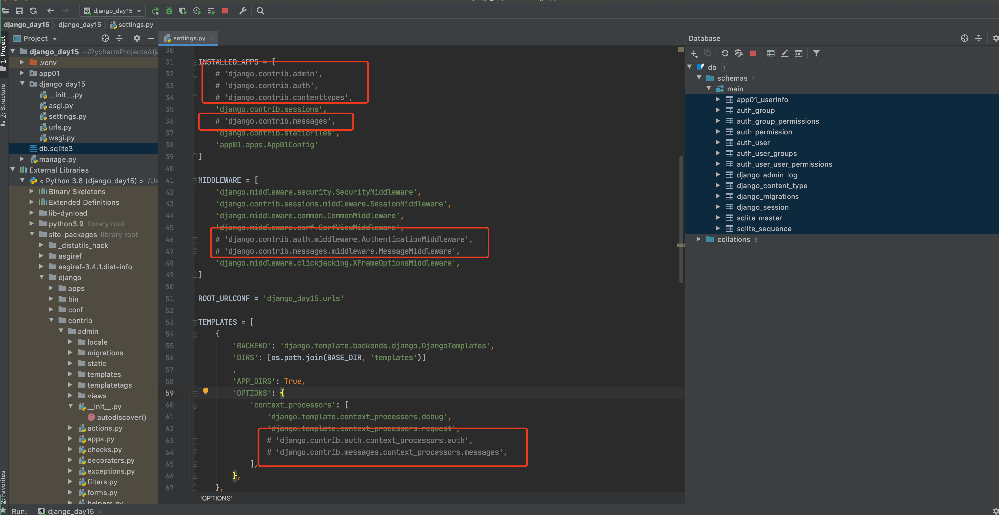

# day15 组件相关

开发者必备：

- 初级：学会框架，用框架去开发项目。
- 中级：开发组件，节省时间去学习 深入 & 广度。
- 高级开发 OR 架构师：设计平台架构、并发量、扩展性。


今日概要：

- 组件
  - 简易版，适用于简单的项目，例如：管理员、普通用户。【本机直播课】
    - 案例1：用户认证。
    - 案例2：权限&菜单&导航。
  - 复杂版，使用与业务复杂的项目，例如：用户定义各种角色。【crm项目 1.11.7 】
- Django中内置组件
  - 核心：常用
  - 非核心：不常用


## 1. 用户认证组件

在django中开发一些组件，一般都会以app的形式存在。

```
dj_demos
├── account 组件
│   ├── __init__.py
│   ├── admin.py
│   ├── apps.py
│   ├── migrations
│   │   └── __init__.py
│   ├── models.py
│   ├── tests.py
│   └── views.py
├── dj_demos
│   ├── __init__.py
│   ├── __pycache__
│   │   ├── __init__.cpython-39.pyc
│   │   └── settings.cpython-39.pyc
│   ├── asgi.py
│   ├── settings.py
│   ├── urls.py
│   └── wsgi.py
└── manage.py
```


关于验证码的存储：




扩展：

- 登录（实现）
- 注册
- 短信登录
- 忘记密码


注意：此时的你们开发的组件，不必让他的通用性太强。（博客项目、Bug管理平台）


### 小结

- django中模板的查找顺序

- pillow生成图片 & 验证码

- session_key 和 redis（session_key一定要先生成才能用）。

  ```
  程序第一次：request.session['xxx'] = 123
  手动生成：request.session.create()
  ```

- Form验证（自定义字段、重新init方法、钩子方法、传递request参数）

- 在配置文件中设置字符串。

  ```
  ACCOUNT_LOGIN_MODEL_CLASS = "web.models.UserInfo"
  ```

- 中间件的 process_request


## 2. 小型管理平台

- 左侧菜单结构
- 路径导航结构
- 权限的控制


### 2.1 页面结构化处理


### 2.2 业务功能的开发

```
from django.contrib import admin
from django.urls import path, re_path
from app01 import views

urlpatterns = [
    # path('admin/', admin.site.urls),

    path('index/', views.index),

    # 用户管理
    path('user/list/', views.user_list),
    path('user/add/', views.user_add),
    re_path(r'user/delete/(?P<pk>\d+)/', views.user_delete),
    re_path(r'user/edit/(?P<pk>\d+)/', views.user_edit),

    # 订单管理
    path('order/list/', views.order_list),
    path('order/add/', views.order_add),
    re_path(r'order/delete/(?P<pk>\d+)/', views.order_delete),
    re_path(r'order/edit/(?P<pk>\d+)/', views.order_edit),

    # 商品管理
    path('goods/list/', views.goods_list),
    path('goods/add/', views.goods_add),
    re_path(r'goods/delete/(?P<pk>\d+)/', views.goods_delete),
    re_path(r'goods/edit/(?P<pk>\d+)/', views.goods_edit),
]

```


```python
from django.shortcuts import render


def index(request):
    return render(request, 'index.html')


def user_list(request):
    return render(request, 'index.html')


def user_add(request):
    return render(request, 'index.html')


def user_delete(request, pk):
    return render(request, 'index.html')


def user_edit(request, pk):
    return render(request, 'index.html')


def order_list(request):
    return render(request, 'index.html')


def order_add(request):
    return render(request, 'index.html')


def order_delete(request, pk):
    return render(request, 'index.html')


def order_edit(request, pk):
    return render(request, 'index.html')


def goods_list(request):
    return render(request, 'index.html')


def goods_add(request):
    return render(request, 'index.html')


def goods_delete(request, pk):
    return render(request, 'index.html')


def goods_edit(request, pk):
    return render(request, 'index.html')

```


### 2.3 URL先进行处理

给每个URL设置一个name

```python
from django.contrib import admin
from django.urls import path, re_path
from app01 import views

urlpatterns = [

    re_path(r'index/', views.index, name="index"),

    # 用户管理
    re_path(r'user/list/', views.user_list, name="user_list"),
    re_path(r'user/add/', views.user_add, name="user_add"),
    re_path(r'user/delete/(?P<pk>\d+)/', views.user_delete, name="user_delete"),
    re_path(r'user/edit/(?P<pk>\d+)/', views.user_edit, name="user_edit"),

    # 订单管理
    re_path(r'order/list/', views.order_list, name="order_list"),
    re_path(r'order/add/', views.order_add, name="order_add"),
    re_path(r'order/delete/(?P<pk>\d+)/', views.order_delete, name="order_delete"),
    re_path(r'order/edit/(?P<pk>\d+)/', views.order_edit, name="order_edit"),

    # 商品管理
    re_path(r'goods/list/', views.goods_list, name="goods_list"),
    re_path(r'goods/add/', views.goods_add, name="goods_add"),
    re_path(r'goods/delete/(?P<pk>\d+)/', views.goods_delete, name="goods_delete"),
    re_path(r'goods/edit/(?P<pk>\d+)/', views.goods_edit, name="goods_edit"),
]
```


### 2.4 菜单和权限配置

```python
ADMIN_MENU = [
    {
        "text":"客户管理",
        "children":{
            {"name":"user_list", "url":"/user/list", "text":"用户列表"},
            {"name":"order_list", "url":"/order/list", "text":"订单列表"},
        }
    },
    {
        "text":"商品管理",
        "children":{
            {"name":"goods_list", "url":"/goods/list", "text":"商品列表"},
        }
    },
]

ADMIN_PERMISSION = {
    "user_list":{"text":"用户列表", "parent":None, "menu_text":"客户管理" },
    "user_add":{"text":"添加用户", "parent":"user_list"},
    "user_delete":{"text":"删除用户","parent":"user_list"},
    "user_edit":{"text":"编辑用户", "parent":"user_list"},
    
    "order_list":{"text":"订单列表", "parent":None, "menu_text":"客户管理" },
    "order_add":{"text":"添加订单", "parent":"order_list"},
    "order_delete":{"text":"删除订单", "parent":"order_list"},
    "order_edit":{"text":"编辑订单", "parent":"order_list"},
    
    "goods_list":{"text":"商品列表", "parent":None, "menu_text":"客户管理" },
    "goods_add":{"text":"添加商品", "parent":"goods_list"},
    "goods_delete":{"text":"删除商品","parent":"goods_list"},
    "goods_edit":{"text":"编辑商品","parent":"goods_list"},
}
```

注意：提前将用户菜单和权限管理编写到配置文件中。

```python
USER_MENU = [
    {
        "text":"客户管理",
        "children":{
            {"name":"order_list", "url":"/order/list", "text":"订单列表"},
        }
    }
]


ADMIN_PERMISSION = {
    "order_list":{"text":"订单列表", "parent":None, "menu_text":"客户管理" },
    "order_add":{"text":"添加订单", "parent":"order_list"},
    "order_delete":{"text":"删除订单", "parent":"order_list"},
    "order_edit":{"text":"编辑订单", "parent":"order_list"},
}
```


### 2.5 权限处理 & 菜单

- 登录，获取用户角色信息。  同时获取其相关权限信息。
- 实现当前用户菜单信息


你字需要做如下的几件事：

1. 在settings.py配置你的菜单和权限

2. 在settings.py 中应用编写的中间件

   ```
   MIDDLEWARE = [
       'django.middleware.security.SecurityMiddleware',
       'django.contrib.sessions.middleware.SessionMiddleware',
       'django.middleware.common.CommonMiddleware',
       'django.middleware.csrf.CsrfViewMiddleware',
       'django.contrib.auth.middleware.AuthenticationMiddleware',
       'django.contrib.messages.middleware.MessageMiddleware',
       'django.middleware.clickjacking.XFrameOptionsMiddleware',
       'manager.middleware.manager.ManagerMiddleware' # 就是它
   ]
   ```

3. 在模板中应用inclusion_tag

   ```html
   
   
   <!DOCTYPE html>
   <html lang="en">
   <head>
       <meta charset="UTF-8">
       <title>管理平台</title>
     ...
   <div class="pg-body">
       <div class="left-menu">
           <div class="menu-body">
               
           </div>
       </div>
       <div class="right-body">
   ...
   ```

   

### 2.6 路径导航

根据当前用户访问的 url -> name，在权限字典中找到父子关联关系。

- 在中间件的process_view中处理，生成列表

  ```
  [x,x,x]
  ```

- 在基于inclusion_生成导航


### 小结

- 数据结构的设计
- 中间件：process_request、 process_view（路由匹配之后）
- 数据封装 Manager对象
- inclusion_tag


## 3.路由系统相关

- 小型管理平台开发，找到URL中所有的路由再拼接相关中文。
- crm项目中发现URL的功能（URL、Name、中文需要手动编写）。


在Django是否可以在定义路由时，同时也定义文本。




如果让django支持额外的设置text参数呢？

```python
import os
import sys
import django
import importlib
import json

base_dir = os.path.dirname(os.path.dirname(os.path.abspath(__file__)))
sys.path.append(base_dir)
os.environ.setdefault("DJANGO_SETTINGS_MODULE", "dj_manager.settings")
django.setup()

import re
from collections import OrderedDict
from django.conf import settings
from django.utils.module_loading import import_string
from django.urls import URLResolver, URLPattern


def recursion_urls(pre_namespace, pre_url, urlpatterns, url_ordered_dict):
    """
    递归的去获取URL
    :param pre_namespace: namespace前缀，以后用户拼接name
    :param pre_url: url前缀，以后用于拼接url
    :param urlpatterns: 路由关系列表
    :param url_ordered_dict: 用于保存递归中获取的所有路由
    :return:
    """
    for item in urlpatterns:
        if isinstance(item, URLPattern):  # 非路由分发，讲路由添加到url_ordered_dict
            if not item.name:
                continue

            if pre_namespace:
                name = "%s:%s" % (pre_namespace, item.name)
            else:
                name = item.name

            url = pre_url + item.pattern._regex  # /rbac/user/edit/(?P<pk>\d+)/
            url = url.replace('^', '').replace('$', '')

            text = item.pattern.text
            url_ordered_dict[name] = {'name': name, 'url': url, 'text': text}


        elif isinstance(item, URLResolver):  # 路由分发，递归操作
            if pre_namespace:
                if item.namespace:
                    namespace = "%s:%s" % (pre_namespace, item.namespace,)
                else:
                    namespace = item.namespace
            else:
                if item.namespace:
                    namespace = item.namespace
                else:
                    namespace = None
            recursion_urls(namespace, pre_url + item.pattern._regex, item.url_patterns, url_ordered_dict)


def get_all_url_dict():
    """
    获取项目中所有的URL（必须有name别名）
    :return:
    """
    # 希望以后获取到的所有的URL和text、text都放在这个字典中。
    url_ordered_dict = OrderedDict()

    md = importlib.import_module(settings.ROOT_URLCONF)
    recursion_urls(None, '/', md.urlpatterns, url_ordered_dict)  # 递归去获取所有的路由
    return url_ordered_dict


if __name__ == '__main__':
    info = get_all_url_dict()
    for k, v in info.items():
        print(k, v)

```


## 4. Django的组件

- 核心组件

  - 路由系统
  - 中间件
  - 视图 
  - ORM ，如果ORM不满足你的SQL需求时，在Django中支持编写原生SQL（面试）。
  - Form & ModelForm
  - Session
  - 缓存 & redis
  - 模板引擎

- 非核心

  - admin，Django内置一个套后台管理平台（自己测试，操作表） --> stark组件。（xadmin）

    ```
    https://www.cnblogs.com/wupeiqi/articles/7444717.html
    ```

  - auth，Django内置的权限管理的功能。 --> rbac

  - contenttypes，除了路飞学城以外的项目中。

  - session，可以有。但也可以配置不存储在数据库。

    ```
    https://www.cnblogs.com/wupeiqi/articles/5246483.html
    ```

    ```python
    SESSION_ENGINE = 'django.contrib.sessions.backends.cache'  # 引擎
    SESSION_CACHE_ALIAS = 'default'                            # 使用的缓存别名（默认内存缓存，也可以是memcache），此处别名依赖缓存的设置
    
    
    
    CACHES = {
        "default": {
            "BACKEND": "django_redis.cache.RedisCache",
            "LOCATION": "redis://127.0.0.1:6379",
            "OPTIONS": {
                "CLIENT_CLASS": "django_redis.client.DefaultClient",
                "CONNECTION_POOL_KWARGS": {"max_connections": 100}
                # "PASSWORD": "密码",
            }
        }
    }
    ```

    




## 总结

- 组件比较重要。（**）
  - 直播课，简单的组件。
  - CRM项目，复杂的组件。（stark组件参考admin源码升级）
  - Bug管理平台，markdown组件 & 颜色按钮。
- 组件涉及的知识点。
  - 反射
  - 中间件
  - inclusion_tag
  - 等。


## 讨论环节

- 黄一恒，Django和公司实战。
  - Django基础 & 项目实践（bug管理平台、crm项目）-> 小项目（面向内部人员比较少）。
  - 前后端分离：vue.js + django + drf（路飞项目 & 微信裂变平台） --> 大项目（面向用户）
    - drf在django基础上的框架，10大组件 + django ORM + Django缓存 + Django celery。
    - 会用，视图类、序列化器。能进行接口的开发。
    - 源码搞明白。
  - 模块9是路飞学城的项目。

- 李翔

  ```
  武sir 之前讲过Python函数形参都是引用类型吧？今天听go讲的指针 函数里面传参是值拷贝。
  ```

  ```
  Go/Java/C#参数传递，默认都是值引用（值拷贝）。
  	Go，指针
  	Java/C#，ref和out关键字。
  ```

- 秀奎

  ```
  django如何导入已知数据库中的个别数据表?
  ```

- 张坤

  

  数据库 和 ORM不一致。

  ```
  python manage.py makemigrations
  python manage.py migrate --fake
  ```

  


